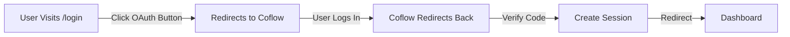
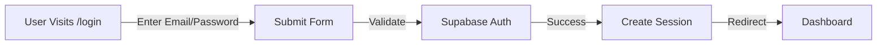

# Authentication Changes Summary

## What's Different Now ✨

### Old System: OAuth (Coflow)
```
❌ Required external OAuth provider
❌ Complex setup with client ID and secret
❌ Multiple redirects and state management
❌ Callback URL configuration needed
❌ Hard to debug
```

### New System: Email/Password (Supabase Auth)
```
✅ Simple email and password
✅ Direct login without redirects
✅ Supabase handles all auth logic
✅ Easy to debug and test
✅ Works offline for testing
✅ No external provider needed
```

## Files Changed

### Deleted (No Longer Needed) ❌

```
app/api/auth/coflow/callback/route.ts
```

### Modified (Updated Functionality) ✏️

```
lib/auth.ts                 → New functions: signInWithEmail(), signUpWithEmail()
app/login/route.ts          → Email/password form instead of OAuth button
app/api/auth/logout/route.ts → Uses Supabase auth instead of custom session
.env.example                → Removed Coflow vars, added Supabase details
```

### Added (New Documentation) ✨

```
EMAIL_PASSWORD_AUTH_GUIDE.md             → Complete setup guide
SUPABASE_DEBUG.md                        → Debugging connection issues
QUICK_SETUP_EMAIL_PASSWORD.md            → 5-step quick start
.env.local.example                       → Example with annotations
OAUTH_TO_EMAIL_PASSWORD_MIGRATION.md     → Technical changes
AUTH_CHANGES_SUMMARY.md                  → This file!
```

## Environment Variables Changes

### Variables to Remove ❌

```env
NEXT_PUBLIC_COFLOW_CLIENT_ID
COFLOW_CLIENT_SECRET
COFLOW_CALLBACK_URL
```

### Variables to Keep ✅

```env
NEXT_PUBLIC_SUPABASE_URL
NEXT_PUBLIC_SUPABASE_ANON_KEY
SUPABASE_SERVICE_ROLE_KEY
```

### Variables to Update ✏️

```env
# Before:
OWNER_EMAIL=your@email.com

# After:
NEXT_PUBLIC_OWNER_EMAIL=your@email.com
```

## Login Flow Changes

### Before (OAuth)



### After (Email/Password)



## How to Migrate Your Setup

### Step 1: Update Environment Variables

```bash
# Edit .env.local
# Remove:
# NEXT_PUBLIC_COFLOW_CLIENT_ID
# COFLOW_CLIENT_SECRET
# COFLOW_CALLBACK_URL

# Add/Update:
NEXT_PUBLIC_SUPABASE_URL=https://your-project.supabase.co
NEXT_PUBLIC_SUPABASE_ANON_KEY=your-anon-key
SUPABASE_SERVICE_ROLE_KEY=your-service-role-key
NEXT_PUBLIC_OWNER_EMAIL=your@email.com
```

### Step 2: Restart Development Server

```bash
# Kill current process (Ctrl+C)
pnpm dev
```

### Step 3: Test Login

```
1. Go to http://localhost:3000/login
2. Click "Create Account"
3. Enter your email and password
4. You should be logged in!
```

## New Login Experience

### For Users (Public Visitors)

```
Before:  [Visit /login] → [Sign In with Coflow] → [Redirects] → Complex!
After:   [Visit /login] → [Enter Email + Password] → [Simple!]
```

### For Owner (Dashboard Access)

```
Before:  Must have Coflow account with specific email
After:   Create account with email/password matching NEXT_PUBLIC_OWNER_EMAIL
```

## Code Changes Example

### Before: Login Function
```typescript
export function getCoflowAuthUrl(): string {
  // Complex OAuth URL generation
  const authUrl = new URL('https://coflow.example.com/oauth/authorize')
  // ... lots of setup code
  return authUrl.toString()
}
```

### After: Login Function
```typescript
export async function signInWithEmail(email: string, password: string) {
  const supabase = createClient(
    process.env.NEXT_PUBLIC_SUPABASE_URL,
    process.env.NEXT_PUBLIC_SUPABASE_ANON_KEY
  )
  const { data, error } = await supabase.auth.signInWithPassword({
    email,
    password,
  })
  // ... simple validation
}
```

Much simpler! ✨

## Database Stays the Same

✅ No database schema changes needed
✅ No data migration required
✅ Same tables (projects, messages)
✅ Same RLS policies
✅ Same API endpoints (except OAuth callback)

## Testing the New System

### Manual Test Checklist

- [ ] Create account at /login
- [ ] Sign in with email/password
- [ ] Access dashboard (/dashboard)
- [ ] Create new project
- [ ] Project appears in gallery
- [ ] Sign out
- [ ] Try accessing dashboard (should redirect to login)

### Automated Testing (if you write tests)

```typescript
// Before (OAuth)
it('should redirect to Coflow', () => { ... })

// After (Email/Password)
it('should sign up user', async () => {
  const result = await signUpWithEmail('test@example.com', 'password')
  expect(result.success).toBe(true)
})

it('should sign in user', async () => {
  const result = await signInWithEmail('test@example.com', 'password')
  expect(result.success).toBe(true)
})
```

## Benefits Summary

| Aspect | Before (OAuth) | After (Email/Password) |
|--------|---|---|
| Setup Time | 20-30 min | 5 min |
| Debugging | Hard | Easy |
| Testing | Requires OAuth | Direct email/password |
| External Dependency | Yes (Coflow) | No |
| User Experience | More redirects | Smooth, direct |
| Security | OAuth provided | Supabase provided |
| Customization | Limited | Full control |

## Support Documents

For specific help, read:

1. **EMAIL_PASSWORD_AUTH_GUIDE.md** (Start here!)
   - Complete setup instructions
   - Testing procedures
   - Troubleshooting guide

2. **SUPABASE_DEBUG.md**
   - Connection issues
   - Environment variable help
   - Credential verification

3. **QUICK_SETUP_EMAIL_PASSWORD.md**
   - 5-step quick start
   - Super fast setup

4. **.env.local.example**
   - Example configuration
   - Where to find each value
   - Copy-paste template

## Questions?

**Q: Do I need to change my database?**
A: No! Database stays the same.

**Q: Do I need a Coflow account now?**
A: No! Just use email/password.

**Q: Can I go back to OAuth?**
A: Technically yes, but email/password is simpler. Ask a developer if needed.

**Q: Will my projects/messages be lost?**
A: No! They stay in the database. Only auth method changed.

**Q: Is email/password secure?**
A: Yes! Supabase handles hashing and validation securely.

**Q: Can I use both OAuth and email/password?**
A: Yes, but we've only implemented email/password for now.

## Next Steps

1. Read **EMAIL_PASSWORD_AUTH_GUIDE.md**
2. Update your **.env.local** file
3. Run **pnpm dev**
4. Test login at **/login**
5. Create a test project
6. Deploy to production

You're all set! 🎉

